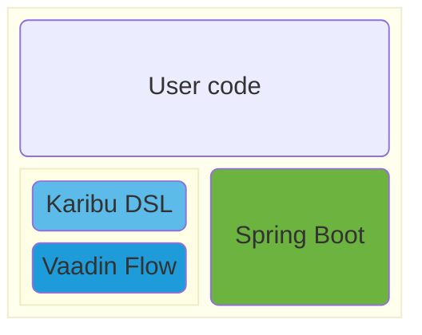

# ionSpring application architecture

An ionSpring application is a Spring Boot application first and foremost. It will typically be written in Kotlin and using Vaadin Flow for the user interface, using Karibu DSL for a better Kotlin integration.

## Kotlin language

[Kotlin](https://kotlinlang.org/){:target="_blank"} is a general purpose high-level programming language. It began as a an alternative language to Java for the Java Virtual Machine. It now supports other platforms (Javascript and native for example).

Kotlin can be seen as a "better" Java, while this is highly subjective, Kotlin has, for example, the following advantages over Java:
* very advanced type inference
* more concise (partly thanks to type inference)
* saner defaults (visibility, final by default, read-only by default)
* extension functions to add functionnality to existing classes
* null safety

In 2019, Google, made Kotlin the preferred language for developping Android applications, making it a very solid language.

While it is possible to use Java with ionSpring, Kotlin is recommended and more effective.

## Spring Boot

[Spring Boot](https://spring.io/projects/spring-boot){:target="_blank"} is the leading Java Application Framework. It provides many functionalities, for example:
* **Dependency injection:** in a modular application, dependency injection takes care of creating the required modules and passing them to the current module. While not perfect, the closest analogy with RPG would be a system that automatically finds the modules and service programs required by a RPG module.
* **Model-View-Controller (MVC):** helps to create web applications while separating the Model (the data), the View (how data are presented) and the controller (the logic). In an RPG application, the RPG program is the model and the controller, the view is a display file (DSPF) or printer file (PRTF). This module is not always used in ionSpring applications, the web interface is generally created using Vaadin Flow. Spring MVC can be used to create REST web services for example.
* **Spring Data JPA:** helps to access the database. It is possible to write very complex applications with little or no handwritten SQL. It will also handle transactions (commit/rollback) automatically. RPG has naturally a very good database integration, Spring Data JPA brings that integration to a Java application and more (for example SQL generation).
* **Security:** provides authentication and authorization to your application. ionSpring preconfigures Spring Security to use IBM i user profiles. In a RPG application, authentication is provided by the operating system (when the user opens the 5250 session), authorization is partly done by the operating system (via the authorizations on database files) but mostly left to the developper of the RPG programs.

Spring Boot is a very mature project with a very high forward compatibility while being actively developed.

## Vaadin Flow

[Vaadin Flow](https://www.vaadin.com/){:target="_blank"} is a Java Web UI application framework.

Nowadays, web applications are generally divided between:
* **The backend:** the part that runs on the server. Generally provides REST API that are called by the frontend. Can be coded with many programming languages (Java, Javascript, RPG, PHP for example).
* **The frontend:** the part that runs on the user workstation in the browser. It is responsible for the displaying of the used interface. Generally communicates with the backend by calling REST APIs. Generally coded in javascript.

There is a very tight integration between the frontend and the backend which is sometimes difficult to maintain.

Vaadin Flow hides this complexity by allowing you to have a single code that is automatically split between the frontend and the backend. It provides a unified programming experience similar to RPG/Display File programming.

## Karibu DSL

[Karibu DSL](https://github.com/mvysny/karibu-dsl){:target="_blank"} is a Kotlin extension and DSL library for Vaadin Flow. It allows to use a Domain Specific Language in Kotlin to build Vaadin Flow user interface instead of a much more verbose Java version.

While it is less mainstream than Spring Boot or Vaadin, Karibu DSL is a much less complex library. Making it less risky long term.

# Maven artifacts

ionSpring is available on [Maven Central](https://mvnrepository.com/repos/central){:target="_blank"} repository in the org.ionspring group.

In the current release, there are 2 autoconfiguration artifacts and one starter artifacts.

**Autoconfiguration** creates Spring Beans with reasonnable defaults that can be overriden. Autoconfigurations do not include third party libraries they use, they will not activate unless those libraries are otherwise imported in the project.

**Starter** include one or more autoconfiguration artifacts and some third party libraries. They generally don't include any code directly. They are meant to simplify the dependency management by providing typical set of dependencies.

## ionspring-as400-autoconfigure

This artifact provides Spring Boot autoconfiguration around [JTOpen](https://github.com/IBM/JTOpen){:targett="_blank"} (also known as IBM Toolbox for Java or jt400 or "the toolbox"), the IBM provided Java library to connect to IBM i.

It provides the following Spring Beans:
* `AS400`: represents the authentication information and and a set of connections to an IBM i server.
* `DataSource`: a factory of JDBC connections to an IBM i server.
* `AuthenticationProvider`: a Spring Security implementation against user profiles of an IBM i server.

The following configuration properties are used:
* `ionspring.as400.system`: the host name or IP address of the IBM i server to connect to. The default value is `localhost`, it is only suitable if the application is running on IBM i.
* `ionspring.as400.user`: the user name to connect to the IBM i server. The default value is `*CURRENT`, it is only suitable if the application is running on IBM i.
* `ionspring.as400.password`: the password to connect to the IBM i server. The default value is `*CURRENT`, it is only suitable if the application is running on IBM i.

## ionspring-vaadin-autoconfigure

This artifact provides Spring Boot autoconfiguration around Vaadin Flow.

It provides the following Spring Beans/functions:
* `MessageSource` bean: holds translated strings for internationalizing your application.
* `LoginI18n` bean: holds translated strings for the login page.
* `LoginView` class: a Vaadin login page. Currently, the application must subclass the class provided by ionSpring.
* `SecurityConfiguration` class: configures Spring Security to work with Vaadin.
* `MainLayout`: a Vaadin layout using AppLayout.
* `SideNavUtils`: a set of extension functions to create a side navigation.

## ionspring-starter

This artifact includes the following artifacts:
* ionspring-as400-autoconfigure
* ionspring-vaadin-autoconfigure
* JTOpen